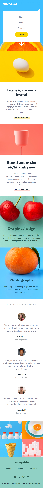

# Frontend Mentor - Sunnyside agency landing page solution

This is a solution to the [Sunnyside agency landing page challenge on Frontend Mentor](https://www.frontendmentor.io/challenges/sunnyside-agency-landing-page-7yVs3B6ef). Frontend Mentor challenges help you improve your coding skills by building realistic projects.

## Table of contents

- [Overview](#overview)
  - [The challenge](#the-challenge)
  - [Screenshot](#screenshot)
  - [Links](#links)
- [My process](#my-process)
  - [Built with](#built-with)
  - [What I learned](#what-i-learned)
- [Author](#author)

## Overview

### The challenge

Users should be able to:

- View the optimal layout for the site depending on their device's screen size
- See hover states for all interactive elements on the page

### Screenshot




### Links

- Solution URL: [Add solution URL here](https://your-solution-url.com)
- Live Site URL: [Add live site URL here](https://your-live-site-url.com)

## My process

### Built with

- Semantic HTML5 markup
- CSS custom properties
- Flexbox
- CSS Grid
- Mobile-first workflow

### What I learned

```css
.menu {
        position: relative;
        background-color: transparent;
        padding: 0rem;
        margin-top: 0rem;
        min-height: 0vh;
        flex-direction: row;
        justify-content: space-between;
        align-items: center;
        display: flex;
        width: 400px;
        font-weight: 500;
        color: var(--white);
        font-size: 16px;
    }
    .contact {
        width: 30%;
        background-color: var(--white);
        padding: 0.7rem 0rem;
    }
    .contact:hover {
        background-color: rgba(255, 255, 255, 0.25);
        color: var(--white);
    }
    .menu::after {
        display: none; 
    }
    .container {
        width: 100%;
    }
    .one {
        display: flex;
        flex-direction: row-reverse;
    }
    .two {
        display: flex;
    }
    .container img {
        width: 50vw;
        height: 90vh;
    }
    section div {
        min-height: 90vh;
        justify-content: center;
        align-items: flex-start;
        padding: 0 0rem;
        margin: 0rem 5.5rem;
        text-align: left;
    }
```

## Author

- Frontend Mentor - [@chrisesbueno](https://www.frontendmentor.io/profile/chrisesbueno)
- Twitter - [@chrisesbueno](https://www.twitter.com/chrisesbueno)

